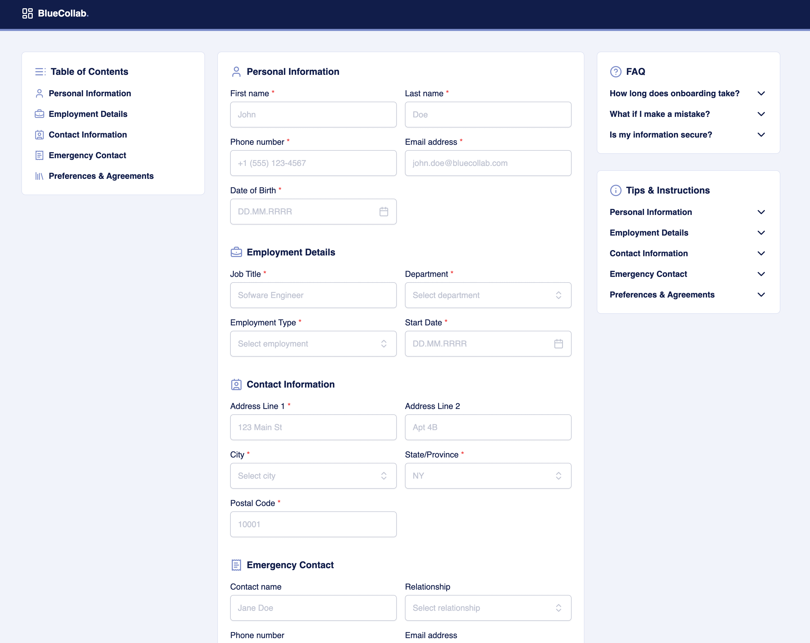

# BlueCollab

A React + TypeScript + Vite project.

## Getting Started

1. Clone the repository
2. Install dependencies with `pnpm install` or `npm install`
3. Start the development server with `pnpm dev` or `npm run dev`
4. Open http://localhost:5173 to view the app in your browser

## Features

- React 18 with TypeScript
- Vite for fast development and building
- TailwindCSS for styling
- Path aliases configured for clean imports
- ESLint and Prettier for code quality
- Inter variable font included
